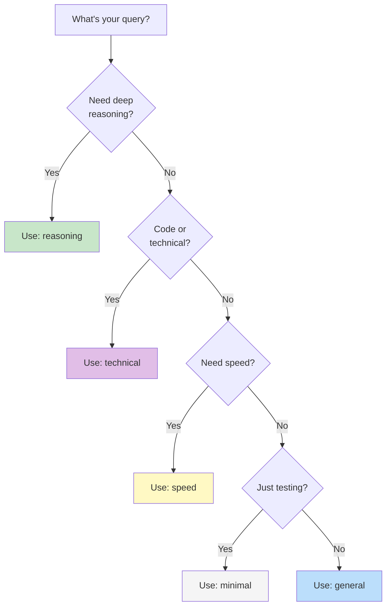

# Model Selection Guide
{: .no_toc }

How to choose and configure model pools for optimal fusion results.
{: .fs-6 .fw-300 }

## Table of contents
{: .no_toc .text-delta }

1. TOC
{:toc}

---

## Principles

### Diversity Over Quantity

{: .important }
> **5 diverse models > 10 similar models**

Choose models with different:
- **Architectures** — MoE vs. dense transformers
- **Training approaches** — RLHF vs. constitutional AI
- **Specializations** — general vs. code vs. reasoning
- **Providers** — different training data sources

### The Synthesizer Matters Most

The synthesis model determines final quality. Use the **strongest reasoner** as synthesizer, even if input pool uses lighter models.

For free tier: **DeepSeek R1** is the best synthesizer.

---

## Available Pools

### `reasoning`
{: .d-inline-block }

Best for analysis
{: .label .label-green }

Deep analysis and complex reasoning tasks.

| Model | Size | Role |
|:------|:-----|:-----|
| DeepSeek R1 | 671B MoE | Primary reasoner |
| Qwen3 Coder 480B | 480B MoE | Technical depth |
| Llama 3.3 70B | 70B | Factual breadth |

**Use for:** Strategic analysis, research questions, multi-step reasoning, complex problem solving.

```bash
python -m src.fusion "Analyze the long-term implications of..." reasoning
```

---

### `general`
{: .d-inline-block }

Default
{: .label .label-blue }

Balanced quality for most tasks.

| Model | Size | Role |
|:------|:-----|:-----|
| Llama 3.3 70B | 70B | General quality |
| Gemma 2 27B | 27B | Clear explanations |
| DeepSeek R1 | 671B MoE | Reasoning boost |

**Use for:** General questions, summaries, explanations, writing assistance.

```bash
python -m src.fusion "Explain how..." general
```

---

### `technical`
{: .d-inline-block }

Code & architecture
{: .label .label-purple }

Code, architecture, and technical documentation.

| Model | Size | Role |
|:------|:-----|:-----|
| Qwen3 Coder 480B | 480B MoE | Code specialist |
| DeepSeek R1 | 671B MoE | Technical reasoning |
| Llama 3.3 70B | 70B | Documentation |

**Use for:** Code review, architecture decisions, debugging, technical docs.

```bash
python -m src.fusion "Design a system for..." technical
```

---

### `speed`
{: .d-inline-block }

Low latency
{: .label .label-yellow }

Lower latency for faster responses.

| Model | Size | Role |
|:------|:-----|:-----|
| Gemma 2 9B | 9B | Fast, capable |
| Llama 3.1 8B | 8B | Quick responses |
| Mistral 7B | 7B | Efficient |

**Use for:** Quick answers, simple queries, interactive sessions.

{: .warning }
> Smaller models = faster but potentially lower quality fusion.

```bash
python -m src.fusion "What is..." speed
```

---

### `minimal`
{: .d-inline-block }

Testing
{: .label }

Two-model fusion for quick testing.

| Model | Size | Role |
|:------|:-----|:-----|
| DeepSeek R1 | 671B MoE | Primary |
| Llama 3.3 70B | 70B | Secondary |

**Use for:** Testing the harness, quick experiments, conserving rate limits.

```bash
python -m src.fusion "Test query" minimal
```

---

## Free Tier Models (June 2026)

All models available at **$0** via OpenRouter:

| Model | Provider | Parameters | Context | Strength |
|:------|:---------|:-----------|:--------|:---------|
| DeepSeek R1 | DeepSeek | 671B MoE | 128K | Frontier reasoning |
| Qwen3 Coder 480B | Alibaba | 480B MoE | 262K | Code, long context |
| Llama 3.3 70B | Meta | 70B | 128K | Balanced |
| Gemma 2 27B | Google | 27B | 8K | Clear, structured |
| Gemma 2 9B | Google | 9B | 8K | Fast |
| Llama 3.1 8B | Meta | 8B | 128K | Quick |
| Mistral 7B | Mistral | 7B | 32K | Efficient |
| Nemotron 3 | NVIDIA | - | 128K | Agentic |

**Rate limits:** 20 req/min, 50-1000 req/day per model.

---

## Custom Pools

Create your own pools by modifying `configs/model-pools.yaml`:

```yaml
pools:
  my_custom_pool:
    description: "My specialized combination"
    models:
      - deepseek/deepseek-r1:free
      - meta-llama/llama-3.3-70b-instruct:free
      - qwen/qwen3-coder-480b-instruct:free
    synthesizer: deepseek/deepseek-r1:free
    use_cases:
      - My specific use case
```

Or programmatically:

```python
from src.models import ModelPool, POOLS

POOLS["my_pool"] = ModelPool(
    name="my_pool",
    description="Custom pool",
    models=[
        "deepseek/deepseek-r1:free",
        "meta-llama/llama-3.3-70b-instruct:free",
    ],
    synthesizer="deepseek/deepseek-r1:free",
)
```

---

## Selection Flowchart



---

## Best Practices

1. **Start with `general`** — good default for most queries
2. **Upgrade to `reasoning`** for important decisions
3. **Use `minimal`** when rate-limited
4. **Match pool to task** — don't use `speed` for complex analysis
5. **Experiment** — try different pools on the same query to see differences
