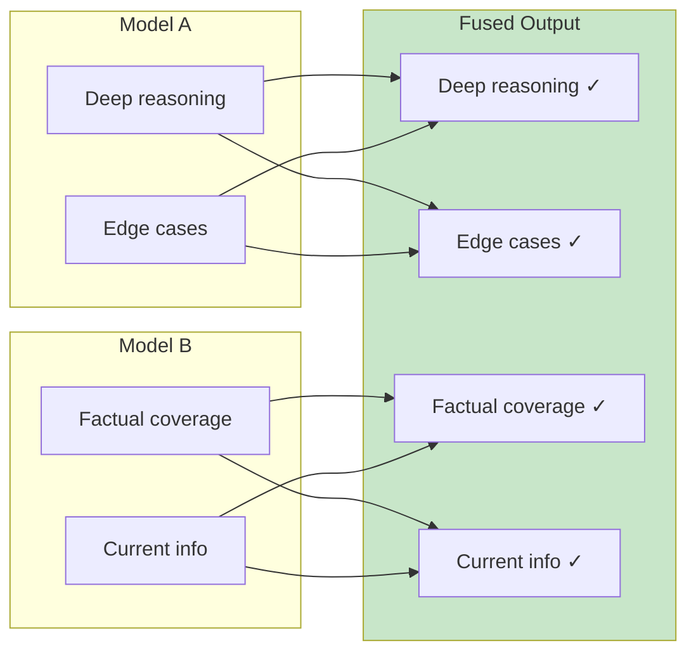
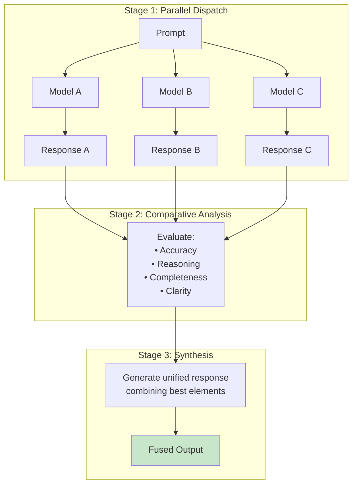

# Fusion AI Theory
{: .no_toc }

Understanding multi-model orchestration for superior AI responses.
{: .fs-6 .fw-300 }

## Table of contents
{: .no_toc .text-delta }

1. TOC
{:toc}

---

## Core Concepts

### What is Fusion AI?

**Fusion AI** applies ensemble learning principles at inference time. Instead of relying on a single model's output, you:

1. **Query multiple models** with the same prompt in parallel
2. **Analyze their outputs** for complementary strengths
3. **Synthesize a unified response** that combines the best elements

This is fundamentally different from:
- **Model selection** — picking one model per query
- **Majority voting** — selecting the most common answer
- **Best-of-N sampling** — generating N responses from one model, picking best

{: .highlight }
Fusion creates something new — a response *none of the individual models produced*.

### Why Fusion Works

Different models have different:

| Dimension | Variation |
|:----------|:----------|
| **Training data** | Different knowledge cutoffs and domains |
| **Architectures** | MoE vs. dense, different attention patterns |
| **Optimization** | Some tuned for helpfulness, others for accuracy |
| **Failure modes** | Different hallucination patterns |

When you fuse outputs:



---

## The Multi-Model Spectrum

Fusion is one approach on a spectrum of strategies:

| Approach | How It Works | Quality | Cost |
|:---------|:-------------|:--------|:-----|
| **Single Model** | One model for all | Baseline | 1x |
| **Model Routing** | Route to best model per task | High | 1x (optimized) |
| **Best-of-N** | N samples, pick best | Medium-High | Nx |
| **Majority Voting** | Most common answer | Medium-High | Nx |
| **Fusion** | Parallel query + synthesize | **Highest** | 3-7x |

### When to Use Each

| Strategy | Best For |
|:---------|:---------|
| Single Model | High-volume, cost-sensitive |
| Model Routing | Mixed workloads, varied tasks |
| Best-of-N | Creative tasks, want diversity |
| Majority Voting | Factual queries, reducing hallucination |
| **Fusion** | High-stakes, research, accuracy paramount |

---

## Industry Landscape

### Market Signal

{: .important }
> **IDC FutureScape 2026:** "By 2028, 70% of top AI-driven enterprises will use advanced multi-tool architectures to dynamically manage model routing."

### Key Players

#### Managed Services

| Service | Approach | Self-Host? |
|:--------|:---------|:-----------|
| OpenRouter Fusion | Full fusion with synthesis | No |
| Martian | Intelligent routing | No |
| Unify.ai | Routing optimization | No |

#### Enterprise Gateways

| Gateway | Open Source? | Key Strength |
|:--------|:-------------|:-------------|
| **Bifrost** | Yes (Go) | 11µs overhead, MCP support |
| Kong AI Gateway | Partial | API management integration |
| LiteLLM | Yes (Python) | 100+ providers |

---

## The Fusion Pipeline

### Three Stages



### Why Synthesis Beats Selection

**Selection** can only choose from existing outputs.

**Synthesis** creates something new:
- Model A's reasoning + Model B's facts + Model C's structure
- Resolves contradictions by weighing evidence
- Fills gaps one model missed but another covered

---

## Limitations

### When Fusion Struggles

{: .warning }
> **Avoid fusion for:** Strong contradictions, subjective queries, creative writing, code generation, real-time chat

| Scenario | Problem |
|:---------|:--------|
| Strong contradictions | Synthesizer produces muddled output |
| Subjective queries | No ground truth to resolve against |
| Creative writing | Dilutes distinctive voice |
| Code generation | Style conflicts create bugs |
| Real-time chat | Latency too high |

### Cost-Benefit Framework

```
Use fusion when:
Cost of being wrong > Cost of querying multiple models
```

**Typical:** 5-10% of queries are "fusion-worthy" — the high-stakes questions where accuracy justifies overhead.

---

## References

1. [OpenRouter Fusion Guide](https://www.digitalapplied.com/blog/openrouter-fusion-multi-model-ai-responses-guide)
2. [IDC: The Future of AI is Model Routing](https://blogs.idc.com/2025/11/17/the-future-of-ai-is-model-routing/)
3. [Top 5 Enterprise AI Gateways 2026](https://www.getmaxim.ai/articles/top-5-enterprise-ai-gateways-for-multi-model-routing-in-2026/)
4. [Democratizing AI through Model Fusion](https://www.sciencedirect.com/science/article/pii/S295016012500049X)
