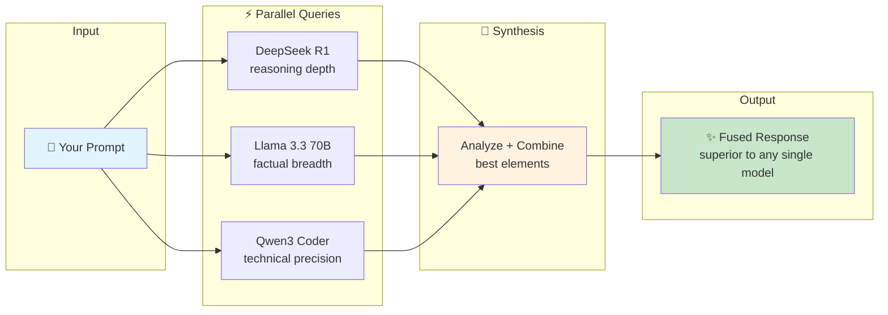
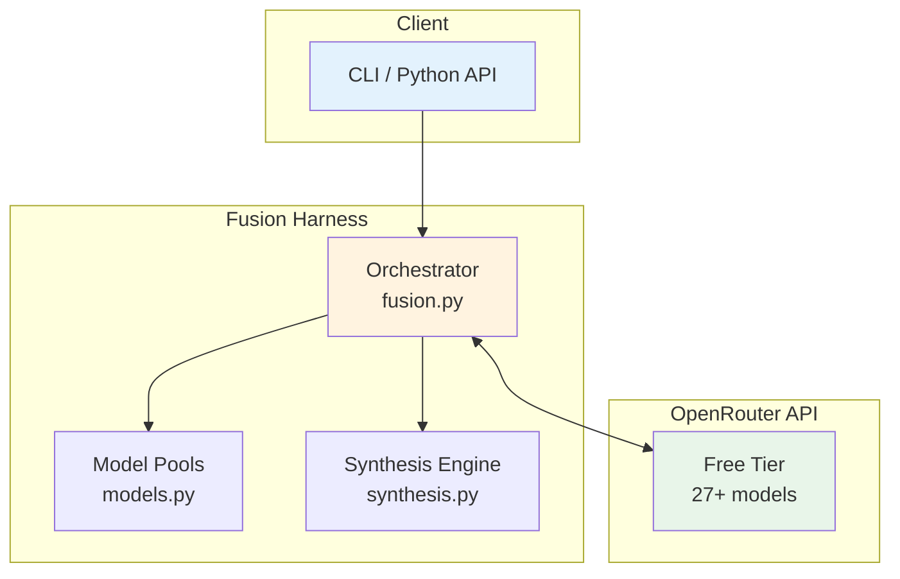

# Fusion AI Harness
{: .fs-9 }

Query multiple LLMs in parallel. Synthesize their outputs into a single, superior response.
{: .fs-6 .fw-300 }

[Get Started](#quick-start){: .btn .btn-primary .fs-5 .mb-4 .mb-md-0 .mr-2 }
[View on GitHub](https://github.com/nordgren/fusion-ai-harness){: .btn .fs-5 .mb-4 .mb-md-0 }

---

## The Fusion Concept

Different AI models have different strengths. **Fusion** combines them:



{: .highlight }
> **Key insight:** Model A might excel at reasoning chains. Model B at factual coverage. Model C at structure. Fusion captures *all three* in a single response.

---

## Why Fusion Works

| Model Strength | Example |
|:---------------|:--------|
| 🧠 **Reasoning depth** | DeepSeek R1 — step-by-step logical chains |
| 📚 **Factual breadth** | Llama 3.3 — comprehensive coverage |
| 🔧 **Technical precision** | Qwen3 Coder — code and architecture |
| ✍️ **Clear structure** | Gemma — well-organized explanations |

The fused output combines the best from each — something *none of the individual models produced*.

---

## Industry Validation

{: .important }
> **IDC FutureScape 2026:** "By 2028, 70% of top AI-driven enterprises will use multi-model routing architectures."

**OpenRouter Fusion** (March 2026) demonstrated that every Deep Research agent *preferred the fused output to its own response*.

---

## Zero Cost

This harness uses **only free-tier models** from OpenRouter:

| Model | Size | Strength |
|:------|:-----|:---------|
| DeepSeek R1 | 671B MoE | Frontier-class reasoning |
| Llama 3.3 70B | 70B | Balanced general quality |
| Qwen3 Coder 480B | 480B MoE | Technical & code tasks |
| Gemini Flash | — | Speed |

**No credit card required.** Free tier: 20 req/min, 50-1000 req/day.

---

## Quick Start

```bash
# Clone
git clone https://github.com/nordgren/fusion-ai-harness.git
cd fusion-ai-harness

# Install
pip install -r requirements.txt

# Set API key (free at openrouter.ai/keys)
export OPENROUTER_API_KEY="sk-or-..."

# Run fusion query
python -m src.fusion "Compare MoE vs dense transformers" reasoning
```

**Output:**
```
Fusion Query using pool: reasoning
Models: deepseek-r1, qwen3-coder-480b, llama-3.3-70b
Synthesizer: deepseek-r1

Stage 1: Querying models in parallel...
  • deepseek-r1: 8,432ms
  • qwen3-coder: 6,891ms
  • llama-3.3-70b: 4,210ms

Stage 2-3: Analyzing and synthesizing...
Synthesis complete in 5,102ms
Total time: 13,534ms

┌─────────────────────────────────────────────┐
│ Fused Response                              │
├─────────────────────────────────────────────┤
│ [Combined best reasoning from all models]   │
└─────────────────────────────────────────────┘
```

---

## Model Pools

Pre-configured combinations for different tasks:

| Pool | Models | Best For |
|:-----|:-------|:---------|
| `reasoning` | DeepSeek R1, Qwen3 Coder, Llama 3.3 | Complex analysis, strategy |
| `general` | Llama 3.3, Gemma, DeepSeek R1 | Most tasks |
| `technical` | Qwen3 Coder, DeepSeek R1, Llama 3.3 | Code, architecture |
| `speed` | Gemma 9B, Llama 8B, Mistral 7B | Quick answers |
| `minimal` | DeepSeek R1, Llama 3.3 | Testing, rate limit conservation |

```bash
# Use a specific pool
python -m src.fusion "Your query" technical
```

---

## When to Use Fusion

{: .new }
✅ **Good for:** Research, high-stakes decisions, fact verification, strategic planning

{: .warning }
❌ **Not ideal for:** Real-time chat, simple queries, high-volume batch jobs, creative writing

**Rule of thumb:** If the cost of being wrong exceeds the latency/complexity of querying multiple models, use fusion.

---

## Architecture



---

## Documentation

| Page | Description |
|:-----|:------------|
| [Theory](/docs/theory) | Concepts, landscape, when to use |
| [Architecture](/docs/architecture) | Design decisions, synthesis strategies |
| [Model Selection](/docs/models) | Choosing pools for different tasks |
| [Evaluation](/docs/evaluation) | Benchmark results |
| [API Reference](/docs/api) | Python API documentation |

---

## About

Built as a learning project to understand multi-model fusion patterns. Inspired by OpenRouter Fusion and the broader industry shift toward multi-model architectures.

**License:** MIT — use freely, attribution appreciated.

[View Source](https://github.com/nordgren/fusion-ai-harness){: .btn .btn-outline }
